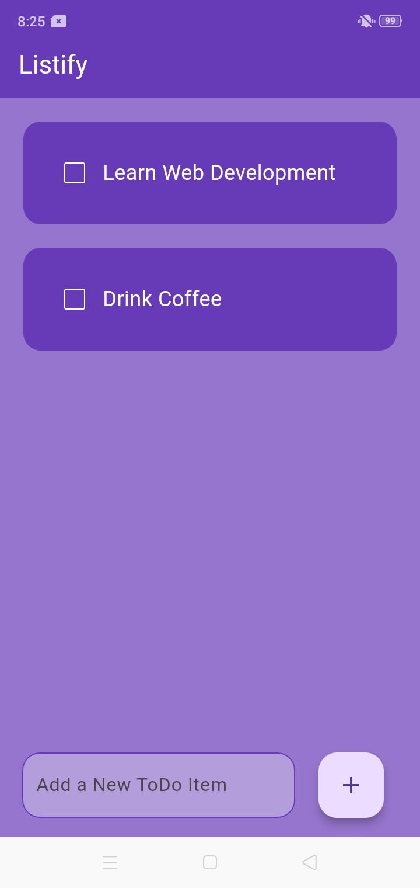
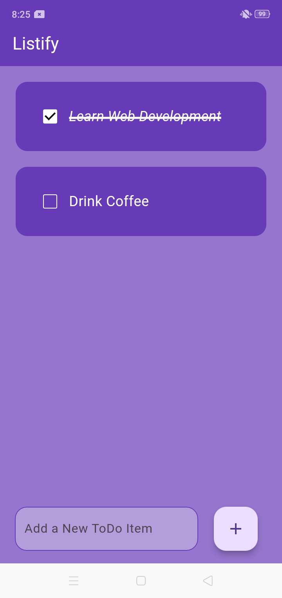
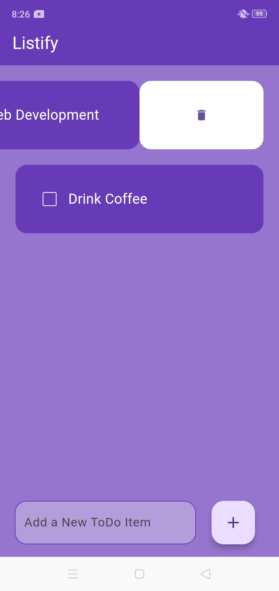
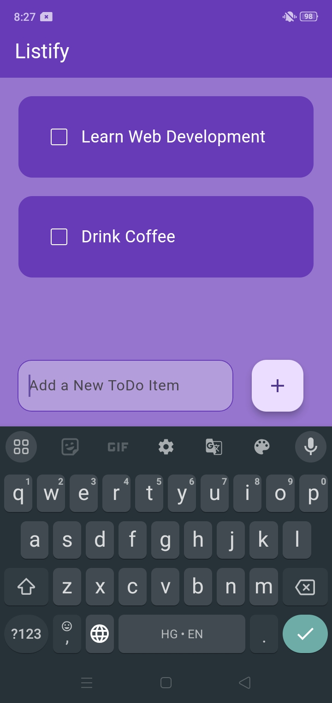

# Listify

Listify is a simple and intuitive to-do list app that helps users manage their daily tasks efficiently.
It offers a user-friendly interface with essential task management features to improve productivity.

## Features

i. Add, edit, and delete tasks easily.
ii. Mark tasks as completed or pending.
iii. Responsive UI with a modern design.

## Tech Stack
Framework: Flutter
Programming Language: Dart
IDE: Android Studio

## Setup Instructions

1. Install Flutter by following the official installation guide: https://flutter-ko.dev/get-started/install

2. Clone the Repository
   git clone https://github.com/daniyalmrz/Listify.git

3. Navigate to the project directory:
   cd Listify

4. Install Dependencies:
   flutter pub get

5. Run the App:
   flutter run

## Screenshots

### Tasks List

### Task Completed

### Delete Task

### Adding New Task

## Author Information

Mohd Daniyal
Linkedin: https://www.linkedin.com/in/daniyalmrz

For help getting started with Flutter development, view the
[online documentation](https://docs.flutter.dev/), which offers tutorials,
samples, guidance on mobile development, and a full API reference.